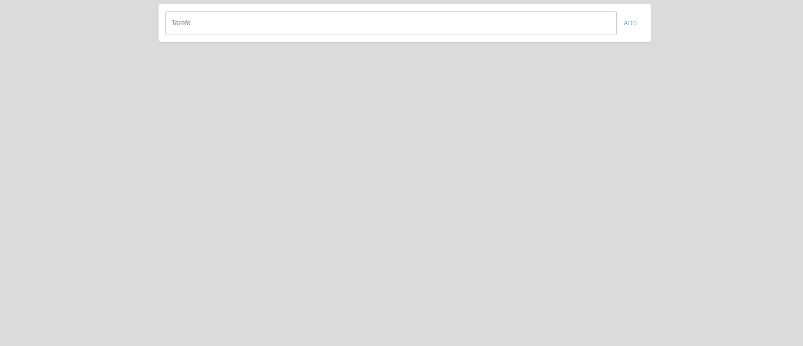

# 
**React Prime APP**

 Esse projeto é um To-do List, onde você pode adicionar ou remover tarefas, ou editar o texto da tarefa por um outro.  

 > Status: Finalizado!

<a href="#features">Features</a> • 
<a href="#requisitos">Pré Requisitos</a> • 
<a href="#tecnologias">Tecnologias</a> • 
<a href="#autor">Autor</a> • 

<h1 align="center">

> [Testar To-do List](https://juniorcaus.github.io/todo-list/)
</h1>

# Features 
- [x] Criando um To-do list com campo de adicionar tarefa
- [x] Tem a opção de adicionar tarefa, assim como a opção de remover ou editar as tarefas.

 

# Requisitos 

Antes de começar, você vai precisar ter instalado em sua máquina as seguintes ferramentas:
 
 [Git](https://git-scm.com), [Node.js](https://nodejs.org/en/).

Você também vai precisar configurar o ambiente para desenvolvimento React no seu PC [React](https://pt-br.reactjs.org/docs/create-a-new-react-app.html).

Além disto é bom ter um editor para trabalhar com o código como [VSCode](https://code.visualstudio.com/).

 

# Tecnologias

As seguintes tecnologias foram usadas durante a construção do projeto:

 - [JavaScript]()
 - [React]()

 

# Autor

 - Feito por Milton Caus  
 
 → [Linkedln.](https://www.linkedin.com/in/miltoncaus/)

Aplicativo feito inspirado em um  video feita pelo 
[Leo Ujo](https://www.youtube.com/watch?v=ipI0IIJJPmo&t=1567s&ab_channel=LeoUjo)

